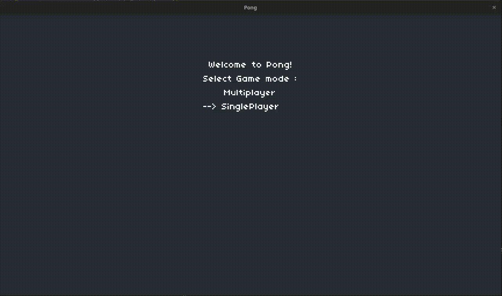

# pongGame

Como fazer um Overengineering com um tipo de jogo que não precisa nem de laço for para ser finalizado.

Coisas Úteis: 
- design pattern subject observer em Lua
- Exemplo de classe em Lua





# Como executar
Esse jogo foi com Love2D, uma biblioteca Muito fácil de ser
instalada. Siga as instruções de instalação oficiais do site: [love 2d](https://love2d.org/).

## Linux
```zsh
git clone https://github.com/samuel-cavalcanti/pongGame
cd pongGame
love source
# have Fun!
```
# Lembre-se
Esse Gif é você ganhando da IA.